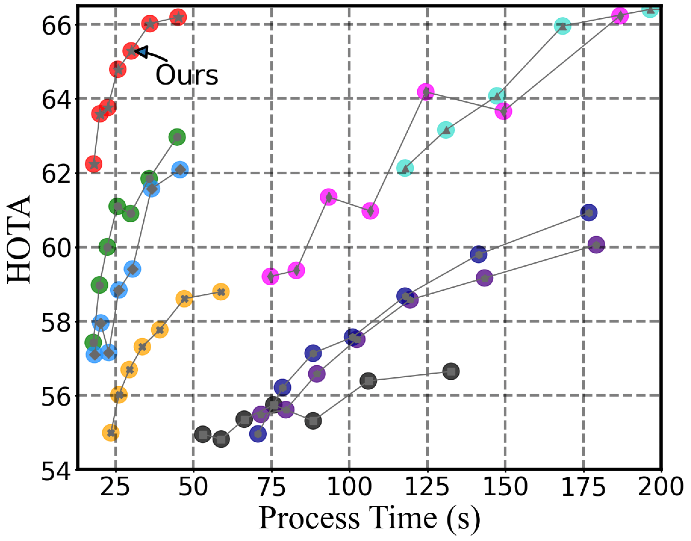

# S(ampling)R(esilient)-Tracker

#### SR-Tracker-WDL is a fast tracker for Sampling-Resilient Multi-Object Tracking with deep learning. The version that does not use deep learning can be lighter, please see the main branch.

## Tracking performance

### Results on the Down-Sampled MOT17 Benchmark Datasets



## Installation

### 1. Installing on the host machine

**We build our code based on ByteTrack, so you need to download our code first, and then use ByteTrack's environment and code to build.**

Step1. Install ByteTrack.

```shell
git clone https://github.com/ifzhang/ByteTrack.git
cd ByteTrack
pip3 install -r requirements.txt
python3 setup.py develop
```

Step2. Install [pycocotools](https://github.com/cocodataset/cocoapi).

```shell
pip3 install cython; pip3 install 'git+https://github.com/cocodataset/cocoapi.git#subdirectory=PythonAPI'
```

Step3. Others

```shell
pip3 install cython_bbox
```

## Data preparation

Download [MOT17](https://motchallenge.net/), [MOT20](https://motchallenge.net/), [CrowdHuman](https://www.crowdhuman.org/), [Cityperson](https://github.com/Zhongdao/Towards-Realtime-MOT/blob/master/DATASET_ZOO.md), [ETHZ](https://github.com/Zhongdao/Towards-Realtime-MOT/blob/master/DATASET_ZOO.md) and put them under <ByteTrack_HOME>/datasets in the following structure:

```
datasets
   |——————mot
   |        └——————train
   |        └——————test
   └——————crowdhuman
   |        └——————train
   |        └——————val
   |        └——————test
   └——————MOT20
            └——————train
            └——————test
```

Then, you need to turn the datasets to COCO format and mix different training data:

```shell
cd <ByteTrack_HOME>
python3 tools/convert_mot17_to_coco.py
python3 tools/convert_mot20_to_coco.py
python3 tools/convert_dance_to_coco.py
```

Then, down-sampling the video to a variety of frame rate configurations needed for the experiment.

```shell
cd <ByteTrack_HOME>
bash sampling_rate.sh
bash sampling_rate_mot20.sh
bash sampling_rate_dance.sh
```

## Model zoo
We are very grateful to Yifu Zhang, the author of ByteTrack, for open-sourcing a powerful library of pretrained weights for multi-object tracking. For the experiments on the MOT17 and MOT20 datasets, we adopted his open source pre-trained weights. For DanceTrack, we used DanceTrack's official open source YOLOX-based pre-training weights.
note: The scene of the MOT20 dataset is single and fixed, so its weight is also based on the detector trained by the scene of the MOT17 dataset.

## Tracking

* **Experiments on MOT17**

Run SR-Tracker on MOT17:
```shell
cd <SRTracker_HOME>
for srate in 1 2 3 4 5 6 7 8 9 10
do
    python3 tools/track_dyte.py -f exps/example/mot/yolox_x_ablation_$srate.py -c pretrained/bytetrack_ablation.pth.tar -b 1 -d 1 --fp16 --fuse -s $srate --experiment-name extendkalmanfilter
done
```
or
```shell
cd <SRTracker_HOME>
bash track_mot17.sh
```
----------
Run ByteTrack on MOT17:
```shell
cd <SRTracker_HOME>
for srate in 1 2 3 4 5 6 7 8 9 10
do
    python3 tools/track.py -f exps/example/mot/yolox_x_ablation_$srate.py -c pretrained/bytetrack_ablation.pth.tar -b 1 -d 1 --fp16 --fuse -s $srate --experiment-name bytetracker
done
```
or
```shell
cd <SRTracker_HOME>
bash track_byte_mot17.sh
```
* **Experiments on MOT20**

Run SR-Tracker on MOT20:
```shell
cd <SRTracker_HOME>
for srate in 1 2 3 4 5 6 7 8 9 10
do
    python3 tools/track_dyte.py -f exps/example/mot/yolox_x_ablation_20$srate.py \
    -c pretrained/bytetrack_ablation.pth.tar -b 1 -d 1 --fp16 --fuse -s $srate --experiment-name extendkalmanfilter6_mot20 --mot20 --stdp 0.05 --stdv 0.0125 --stda 0.00025
done
```
or
```shell
cd <SRTracker_HOME>
bash track_mot20.sh
```
----------
Run ByteTrack on MOT20:
```shell
cd <SRTracker_HOME>
for srate in 1 2 3 4 5 6 7 8 9 10
do
    python3 tools/track.py -f exps/example/mot/yolox_x_ablation_20$srate.py \
    -c pretrained/bytetrack_ablation.pth.tar -b 1 -d 1 --fp16 --fuse -s $srate \
    --experiment-name bytetracker_mot20 --mot20
done
```
or
```shell
cd <SRTracker_HOME>
bash track_byte_mot20.sh
```
* **Experiments on DanceTrack**

Run SR-Tracker on MOT17:
```shell
cd <SRTracker_HOME>
for srate in 1 2 3 4 5 6 7 8 9 10
do
    python3 tools/track_dyte.py -f exps/example/dance/yolox_x_ablation_$srate.py \
    -c pretrained/bytetrack_model.pth.tar -b 1 -d 1 --fp16 --fuse -s $srate --experiment-name extendkalmanfilter6_dancetrack --dance \
    --stdp 0.25 --stda 0.015 --match_thresh_d1 1.0
done

```
or
```shell
cd <SRTracker_HOME>
bash track_dance.sh
```
----------
Run ByteTrack on MOT17:
```shell
cd <SRTracker_HOME>
for srate in 1 2 3 4 5 6 7 8 9 10
do
    python3 tools/track.py -f exps/example/dance/yolox_x_ablation_$srate.py \
    -c pretrained/bytetrack_model.pth.tar -b 1 -d 1 --fp16 --fuse -s $srate \
    --experiment-name bytetracker_dancetrack --dance
done
```
or
```shell
cd <SRTracker_HOME>
bash track_byte_dance.sh
```
* **Test on DanceTrack Without Down-Sampling**

```shell
cd <SRTracker_HOME>
python3 tools/track_dyte.py -f exps/example/dance/yolox_x_ablation_1.py \
-c pretrained/bytetrack_model.pth.tar -b 1 -d 1 --fp16 --fuse --test -s 1 --experiment-name extendkalmanfilter6_dancetrack_test --dance  \
--stdp 0.25 --stda 0.015 --match_thresh_d1 1.0
```

Submit the txt files to [DanceTrack](https://codalab.lisn.upsaclay.fr/competitions/5830#participate) website and you can get 59+ HOTA (For higher MOTA, you need to carefully tune the test image size and high score detection threshold of each sequence).

## Evaluation
We have given the label in the TrackEval format and stored it in an anonymous network disk. The link is as follows: [Link](https://ufile.io/xfexrkjr). Put him under the folder called *data* of our TrackEval.

If you want to run the tracking code and test code as a whole, you can follow the command below：

```shell
cd <SRTracker_HOME>
bash track_mot17.sh
cd <TrackEval_HOME>
python scripts/build_track_dataset.py --tracker_name extendkalmanfilter --inputfile_folder your_root/SRTracker/YOLOX_outputs
for srate in 2 3 4 5 6 7 8 9 10
do
    python scripts/run_srate_mot_challenge.py --BENCHMARK MOT17$srate --change_tracker_name extendkalmanfilter
done
python scripts/plot_metrix_with_sampling.py
```
or
```shell
cd <TrackEval_HOME>
bash test_mot17.sh
```

## Thanks for follow works!
Here are the jobs that have helped us a lot:

```
@article{zhang2022bytetrack,
  title={ByteTrack: Multi-Object Tracking by Associating Every Detection Box},
  author={Zhang, Yifu and Sun, Peize and Jiang, Yi and Yu, Dongdong and Weng, Fucheng and Yuan, Zehuan and Luo, Ping and Liu, Wenyu and Wang, Xinggang},
  booktitle={Proceedings of the European Conference on Computer Vision (ECCV)},
  year={2022}
}
@article{peize2021dance,
  title   =  {DanceTrack: Multi-Object Tracking in Uniform Appearance and Diverse Motion},
  author  =  {Peize Sun and Jinkun Cao and Yi Jiang and Zehuan Yuan and Song Bai and Kris Kitani and Ping Luo},
  journal =  {arXiv preprint arXiv:2111.14690},
  year    =  {2021}
}
@article{luiten2020IJCV,
  title={HOTA: A Higher Order Metric for Evaluating Multi-Object Tracking},
  author={Luiten, Jonathon and Osep, Aljosa and Dendorfer, Patrick and Torr, Philip and Geiger, Andreas and Leal-Taix{\'e}, Laura and Leibe, Bastian},
  journal={International Journal of Computer Vision},
  pages={1--31},
  year={2020},
  publisher={Springer}
}
@misc{luiten2020trackeval,
  author =       {Jonathon Luiten, Arne Hoffhues},
  title =        {TrackEval},
  howpublished = {\url{https://github.com/JonathonLuiten/TrackEval}},
  year =         {2020}
}
```

## Acknowledgement

A large part of the code is borrowed from [YOLOX](https://github.com/Megvii-BaseDetection/YOLOX), [ByteTrack](https://github.com/ifzhang/ByteTrack), [DanceTrack](https://github.com/DanceTrack/DanceTrack), [TrackEval](https://github.com/JonathonLuiten/TrackEval), Many thanks for their wonderful works.

